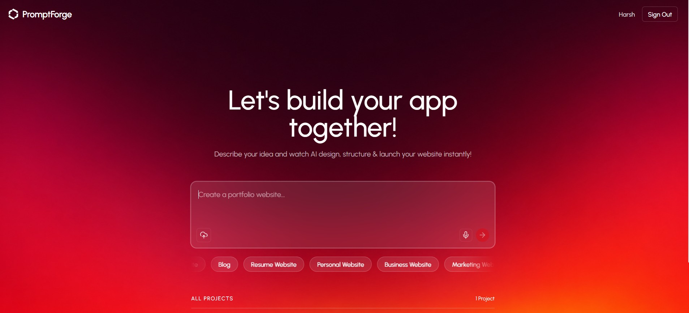
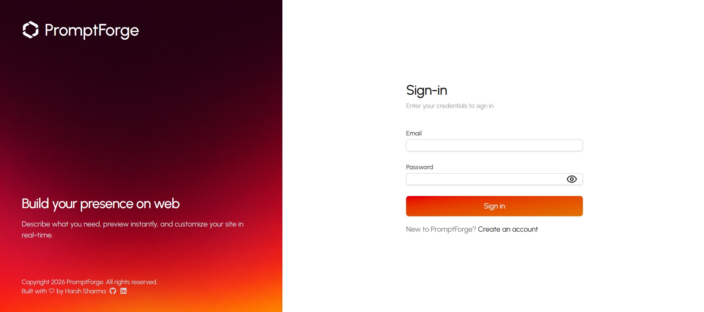
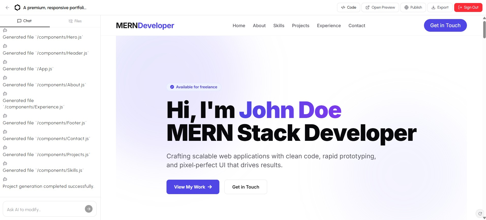
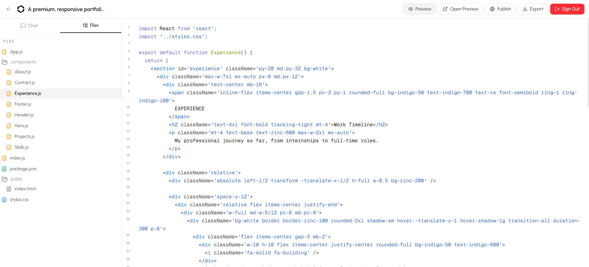
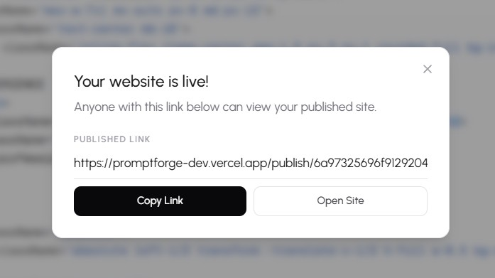

# 🚀 PromptForge - AI-Powered Application Generator

PromptForge is a full-stack **AI-powered web application generator** built with the **MERN Stack**.
It allows users to generate complete React applications using simple natural language prompts, with AI-powered code generation, live preview, file management, editing, publishing, and project export.

---

## 🌐 Live Demo

- **Frontend:** https://promptforge-dev.vercel.app
- **Backend API:** https://promptforge-744l.onrender.com

---

## 📸 Screenshots

### Home



### Application

<table>
  <tr>
    <td></td>
    <td></td>
  </tr>
  <tr>
    <td></td>
    <td></td>
  </tr>
</table>

---

## ✨ Features

- 🤖 AI-Powered React Application Generation
- 💬 AI Chat for Modifying Generated Projects
- 🔐 JWT Authentication & Protected Routes
- 📁 Project & File Management
- 🌳 Interactive File Explorer
- 📝 Live Code Editor
- 👁️ Real-Time Live Preview
- 💾 Automatic Project Saving
- 🚀 One-Click Website Publishing
- 📦 Download Generated Projects as ZIP
- 🔄 AI-Powered Code Updates

---

## 🛠️ Tech Stack

**Frontend:** React, JavaScript, Vite, Tailwind CSS, React-Router, Axios, Sandpack, Lucid-React, React-Hot-Toast

**Backend:** Node.js, Express.js, MongoDB, Mongoose, JWT, Bcrypt

**AI:** Generative AI API

---

## 🚀 Getting Started

```bash
# Clone the repository
git clone https://github.com/harsh0190/PromptForge.git

# Install dependencies
cd client && npm install
cd ../server && npm install

# Start development servers
npm run dev
```

---

## 🤝 Contributing

Contributions are welcome! Feel free to open an issue or submit a Pull Request.

If you found this project helpful, consider giving it a ⭐ on GitHub.
